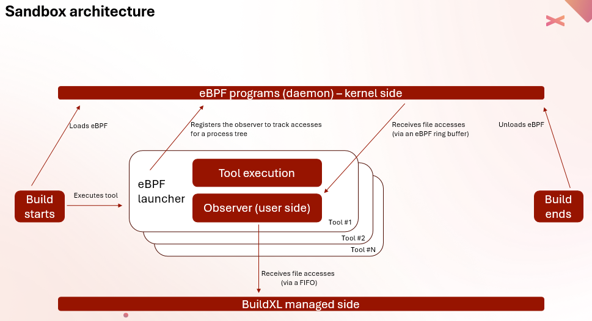
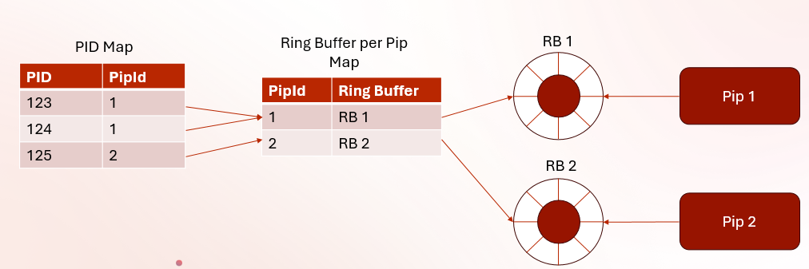

# BuildXL Sandboxing
Process sandboxing is required by BuildXL to observe the actions of processes and, in some cases, to prevent processes from taking certain actions. Each operating system requires different approaches.

## Nomenclature
Glossary for some of the unfamiliar words you'll see in the code.

* A <i>pip</i> is a generic term, an acronym of Primitive Indivisible Processing, a unit of accounting in a build dependency graph. Examples include running real, sandboxed processes or process trees, or waiting for parallel graph nodes to complete.
* A <i>file probe</i> is a filesystem action that tests for a file's presence. Depending on the filesystem and OS, this may map to any of several actual API call patterns.
* "Domino": The internal code name for BuildXL. Its name remains in a few places in the code.

## Windows Sandboxing
For Windows sandboxing we utilize a much more refined and battle-tested version of the [Detours](https://github.com/Microsoft/Detours) codebase, forked a couple of years ago. Detours allows starting a process suspended and then hooking any desired set of Win32 APIs to provide callbacks into custom code, which can implement patterns like counting calls, tracking filesystem calls for accesses, redirecting filesystem paths, blocking access to paths, tracking registry usage, and so on.

Most of the core Detours file names from that repo appear in the Windows sandboxing codebase, but with numerous notes about changes made versus the original. We add a DetoursServices wrapper that implements many important layered enhancements atop the base Detours framework, including detouring a large number of Win32 APIs related to filesystem I/O, adding the ability to block accesses to paths, and reporting out directory enumerations, file probes (checking for file presence), file opens and closes, data reads, and data writes. We also properly handle transitions across 32-bit <-> 64-bit process boundaries.

The blocking capabilities are utilized by the BuildXL sandbox code to block access to disallowed paths, e.g. paths that are known to have been created by other pips that have not been declared as dependencies in the pip dependency graph.

The accounting capabilities are used for bookkeeping and post-execution rule enforcement.

In terms of performance, this implementation adds 1-5% of time overhead to running a process.

Technical note: The top-level process initiating Detours calls must be a 64-bit process. Detours bootstrapping code is hard-coded to start from 64-bit, matching the requirements for large memory needs for the BuildXL engine for parsing and tracking large repos.

## Linux Sandboxing

Akin to Detouring on Windows, the [dynamic loader](https://www.man7.org/linux/man-pages/man8/ld.so.8.html) allows for *library preloading* (a.k.a. function interposing) to hook various system calls.  Just like on Windows, the BuildXL sandbox leverages this feature to intercept all relevant filesystem-related system calls from the standard C library (`libc`) and handle them appropriately (e.g., report all requested accesses to the BuildXL process, block disallowed accesses, etc.).

For a full list of all interposed system calls, see [syscalls.md](/Public/Src/Sandbox/Linux/syscalls.md).

The semantics of how various high-level filesystem operations (e.g., absent probes, directory enumerations, reads, writes, etc.) are handled is expected to be the same on all supported operating systems.

A clear **limitation** of this approach is that in only applies to executables that are **dynamically linked** to `libc`.  In Linux, that is the case for the vast majority of executables.  Notable exceptions, however, are programs written in [`Go`](https://go.dev/) which are by default statically linked.

### An eBPF-based sandbox

A new Linux sandbox is being rolled out based on [eBPF](https://ebpf.io/). The plan is that it will eventually replace the interpose-based sandbox. The main goal is to overcome the limitation mentioned above, where with interpose file accesses can only be detected when executables are dynamically linked and the corresponding libc wrapper is used. [io_uring](https://en.wikipedia.org/wiki/Io_uring) is a clear example of an API that is being increasingly used by tools for which there is no libc wrapper yet, and direct syscalls are being performed. Moreover, io_uring is specifically about IO and therefore particularly disruptive for offering a reliable sandbox.

eBPF allows to trace very low level kernel-side functions, which reduces the list of functions to trace significantly. See [sandbox.bpf.c](Public\Src\Sandbox\Linux\ebpf\sandbox.bpf.c) for a full list.

#### High-level architecture

Each pip is wrapped in a bpf runner program. This program is responsible for setting up the [bpf maps](https://www.kernel.org/doc/html/latest/bpf/maps.html) for the pip in question and acts as the client side consumer of the events captured on kernel side. The bpf runner then sends the captured events through a FIFO to the managed side of BuildXL (in the same way the interpose sandbox does). The runner is also responsible for tearing down the pip.

eBPF programs are only loaded once in the lifetime of a build using an eBPF daemon, which gets launched as soon as the build starts and unloads the bpf programs when the build ends. Each bpf runner just verifies all required programs are already loaded and reuse the bpf maps that are setup by the daemon. The following diagram depicts the general flow:

Each pip is given a dedicated ring buffer to communicate file accesses to user side. A global bpf map tracks which pids need tracking and the pip id that contains that process. A second map contains the ring buffer that corresponds to each pip id. eBPF programs on kernel side lookup the ring buffer where they should place the traced access based on the captured pid, and on user side, each bpf runner registers to listen to a particular ring buffer.

## Sandbox Demos
See the [Demos](../../Public/Src/Demos/Demos.md) page which includes sandbox projects to help understand how sandboxing works.
