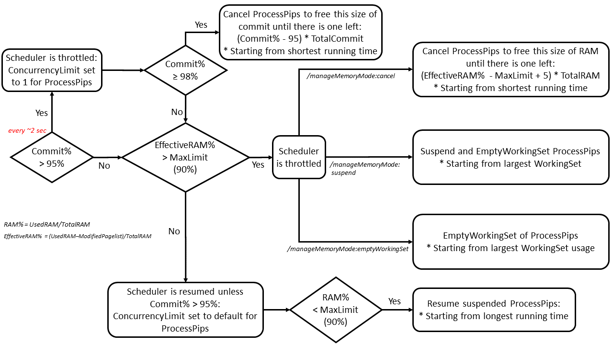

#  Performance tuning

BuildXL's scheduler has various features to optimize the end to end time of builds. Most of these features have configuration options to adjust how these features kick in. Overriding default parameters should be done with caution as it can cause these features to interact in degenerate ways. Before making adjustments, it is important to get a picture of how the scheduler works.

## Understanding BuildXL's Scheduler
### High level overview
Internally, BuildXL has a number of queues for performing different types of work. This allows for operations to be pipelined. For example, downloading build outputs from a remote cache can happen in the background overlapping executing cache misses. These queues, or "dispatchers" are fully described in [DispatcherKind.cs](../../../Public/Src/Engine/Scheduler/WorkDispatcher/DispatcherKind.cs), but the important ones are:
* CacheLookup - Performing cache lookups for process pips
* CPU - CPU intensive tasks like executing cache miss pips
* Materialize - Copying and/or downloading files from the cache

Each dispatcher queue has its own concurrency limit for how many items are concurrently processed before queueing the work to run later. By default, the concurrency limits for these queues are based on the number of processor cores a machine has.

### Critical path
BuildXL will make choices about which process pips to run first and which ones to queue. It aims to optimize this selection for the longest critical path of the build. BuildXL works best with a stateful cache (either local or remote) that it utilizes to store pip runtime information from prior builds. When a new build starts, it retrieves this historical runtime information and uses it combined with the current build graph to calculate a prediction for the paths through the build graph. It prioritizes the longest path when making scheduling decisions. When historical information is not available, it will use a heuristic about the number of input files specified by the pip.

### Weight
The concurrency limit of the CPU is determined based on the assumption that each process pip will utilize one processor core. There are many circumstances where this is not correct. BuildXL will utilize the historic runtime information to schedule some process pips as utilizing more than one slot in that queue. For example, if a process was seen to utilize 300% of a single core on its last invocation, the scheduler will model it as using 3 spaces in the CPU queue when it gets scheduled. This can be controlled via the `/useHistoricalCpuUsageInfo` command line option.

Weight can also be directly specified on a per-pip basis. Any static specification will override weight calculated based on historic information. It is a field in the argument of [Transformer.execute](../../../Public/Sdk/Public/Transformers/Transformer.Execute.dsc)  in DScript that allows user to specify the number.
```ts
Transformer.execute({
        tool: <your tool name>,
        workingDirectory: d`.`,
        arguments: [ /*other args*/ ],
        weight: <integer number representing the weight of this pip>,
        disableCacheLookup: true,
        dependencies: [ /* dependencies list*/],
    });
```

### Process Concurrency Limit
Each dispatcher queue has a concurrency limit for the number of items that can be run concurrently. The CPU queue is the most important for tuning concurrency during the build. The default process pip concurrency limit is [0.9 * CPU core count](../../../Public/Src/Utilities/Configuration/Mutable/ScheduleConfiguration.cs), which means BuildXL will attempt to utilize 90% of a machine's processor cores for child processes. This leaves some headroom for the BuildXL process itself as well as other processes running on the machine. It can be overridden via two flags, but caution should be exercised since this can have a big impact of performance and efficiency of a machine.

    /maxProc:<number of CPU queue slots>
                                Specifies the maximum number of processors BuildXL will attempt to use concurrently.
                                The default value is 90% of the total number of processors in the current machine.
    /maxProcMultiplier:<double> 
                                Specifies maxProc in terms of a multiplier of the machine's processor count.


Two other notable dispatcher queues are the IO queue (WriteFile pips and CopyFile pips), CacheLookup (fingerprinting and cache lookup), and Materialize (downloading content from cache). These queues have externally configurable concurrency limits too, though almost always these should be left to the default values.

    /maxIO:<number of concurrent I/O operations>
                                Specifies the maximum number of I/O operations that BuildXL will launch at one time. The
                                default value is the number of processors in the current machine.
    /maxIOMultiplier:<double>   
                                Specifies maxIO in terms of a multiplier of the machine's processor count.
    /maxCacheLookup:<number of concurrent operations>
                                Specifies the maximum number of cache lookup operations that BuildXL will launch at one time. 
                                The default value is the number of processors in the current machine.
    /maxMaterialize:<number of concurrent operations>   
                                Specifies the maximum number of concurrent materialize operations (e.g., materialize inputs, storing two-phase cache entries, analyzing pip violations). 
                                The default value the number of processors in the current machine.

### Memory throttling
BuildXL monitors physical memory (and commit on Windows) to prevent either from being fully exhausted during a build, since paging memory to disk hurts build performance. When historic performance information is available, BuildXL projects memory usage of future processes it will launch. It also monitors actual utilization. Both signals are used to throttle concurrency. If historic performance information is not available, BuildXL uses very conservative (small) values for predicted memory utilization.

    /maxRamUtilizationPercentage:<number>
                                Specifies the maximum machine wide RAM utilization allowed before the scheduler will
                                stop scheduling more work to allow resources to be freed. Default is 90%.
    /enableLessAggresiveMemoryProjection
                                Specifies that average job object memory counters from historical data should be used 
                                for memory forecasting instead of peak values. Defaults to disabled
    /UseHistoricalRamUsageInfo
                                Specifies that historic RAM usage should be used to speculatively limit the RAM utilization of launched processes. Enabled by default, except in AzureDevOps builds.

Despite throttling the scheduler based on the historical data, builds can still experience high RAM usage. BuildXL has three ways to manage memory when the maximum memory utilization is exceeded. 

    /manageMemoryMode:CancellationRam
                                BuildXL cancels the processes (shortest running time first) when the limits are exceeded. This mode will be deactivated if /disableProcessRetryOnResourceExhaustion is passed. Retrying certain pips is sometimes unsafe due to several reasons. In those cases, developers might disable retrying temporarily to figure out the issue. This is the default mode outside of CloudBuild.
                                
    /manageMemoryMode:EmptyWorkingSet
                                BuildXL empties the working set of RAM when the limits are exceeded. The active pages of processes will be written to the page file. This mode is recommended for machines having large pagefiles. This is the default mode in CloudBuild. Only works on Windows.
                                
    /manageMemoryMode:Suspend
                                BuildXL suspends the processes (largest RAM usage first) when the limits are exceeded. When RAM usage is back to normal, the suspended processes will be resumed. Only works on Windows

Here is the detailed state machine showing how BuildXL manages memory during builds.




## Analyzing Performance
The typical cycle is determining what is the limiting factor of the build, determine whether that is reasonable, and then fix it and iterate. There are many signals and ways to look at performance. This guide aims to explain the most useful ones

### Critical Path
At the end of `BuildXL.log` BuildXL reports **two** critical paths, each broken into its constituent pips and components:

* **Critical Path** — the longest chain through the build graph when each pip is measured by its *work* duration: the running-time steps (cache lookup, execute, materialize, etc.) **excluding** the time pips spend queued waiting for resources. Because queueing is excluded, this number means the same thing on a single-machine build and on a distributed build, and it approximates the fastest possible end-to-end build time.
* **Wall-Clock Critical Path** — the longest chain when each pip is measured by its full wall-clock duration (`CompletedTime − ScheduleTime`), i.e. **including** queue time. This is the chain that actually gated the build *as it ran*, and the scheduler timeline breakdown is anchored on it.

On a fully unconstrained single-machine build (no queueing) the two chains coincide. On a contended or distributed build they can diverge: the Wall-Clock Critical Path highlights what was slow due to contention, while the Critical Path highlights the chain with the most fundamental work. A large gap between a chain's **Total Duration** and **Pip Duration** means resource contention (queueing) dominated, rather than the work itself.

**Column meanings:** **Pip Duration** is the work (queue-excluded). **Exe Duration** is the time a child process was active. **Queue** is the total time the pip was waiting for resources, whether in a local dispatcher queue or queued on a remote worker (distributed builds). **Total Duration** is the pip's end-to-end time including all of the above.

If the **Total** Wall-Clock Critical Path duration (first line) is near the total end to end time of the build, then optimizing the critical path is the best exercise. A significant gap between Pip Duration and Exe Duration means BuildXL added a lot of overhead for the pip. See [Fine-grained Duration](#fine-grained-duration).

A large **Queue** duration means that BuildXL spent a long time waiting to process various stages of the pip. This may mean that critical path information was not available and BuildXL did not make a good predition of the actual critical path. Or it could simply mean that the machine was overloaded and whatever it chose as the victum in scheduling became the critical path by virtue of not being prioritized. A good way to validate for this latter effect is to observe [performance counters](#performance-counters) to see if the machine was fully utilized for long periods overlapping the queue duration.

These two paths are also reported as statistics in `BuildXL.stats` under the `CriticalPath.*` and `WallClockCriticalPath.*` namespaces; see [BuildXL.stats](../How-To-Run-BuildXL/Log-Files/BuildXL.stats.md).

```
Critical Path:
Pip Duration         | Exe Duration         | Queue                | Total Duration       | Pip Result   | Pip
        15422ms (0.3m) |      13365ms (0.2m) |          694ms (0m) |        16100ms (0.3m) |              | *Total
        ...

Wall-Clock Critical Path:
Pip Duration         | Exe Duration         | Queue                | Total Duration       | Pip Result   | Pip
        58167ms (1m) |       50478ms (0.8m) |        3723ms (0.1m) |        61890ms (1m) |              | *Total
         232ms (0m) |            80ms (0m) |             0ms (0m) |           232ms (0m) |     Executed | PipE82B51044F32F2D0, AppHostPatcher.exe, BuildXL.Tools, BxlScriptAnalyzer.exe, {configuration:"debug", targetFramework:"net8.0", targetRuntime:"win-x64"}
         ...
```

### Fine-grained Duration
There are a few sets of pips that get fine grained duration counters recorded in `Fine-grained Duration` sections in `BuildXL.log`. These include the longest running pips, the longest cache lookups, and each pip on the critical path. 

The fields are very coupled to BuildXL's source code and will evolve over time. Important ones to call out are:
* `Step -` These represent states in the pip executor's state machine. CacheLookup and ExecuteProcess are the most notable ones to expect measureable time to be spent
* `Queue -` These are the amount of time the pip spent waiting in various queues to be processed
* `ExeDurationMs` is the closest counter around the lifetime of when the child process was active for a process pip.

```
	Pip94B8CD3C4720FCDD, dotnet.exe, BuildXL.Engine, Scheduler.dll, {configuration:"debug", targetFramework:"net8.0", targetRuntime:"win-x64"}
		Explicitly Scheduled                                                                      :      False
		Queue - CacheLookup                                                                       :          6
		Queue - Materialize                                                                       :         11
		Step  - Start                                                                             :         30
		Step  - CacheLookup                                                                       :          4
		  NumCacheEntriesVisited                                                                  :          0
		  NumPathSetsDownloaded                                                                   :          0
		  NumCacheEntriesAbsent                                                                   :          0
		  PipExecutorCounter.ComputeWeakFingerprint                                               :          3 - occurred          1 times
		Step  - ExecuteProcess                                                                    :       5937
		  InputMaterializationExtraCostMbDueToUnavailability                                      :          0
		  InputMaterializationCostMbForChosenWorker                                               :          0
		  PushOutputsToCacheDurationMs                                                            :         28
		  CacheMissAnalysis                                                                       :          0
		  ExeDurationMs                                                                           :       5889
		Step  - PostProcess                                                                       :         74
		Step  - HandleResult                                                                      :          1
```

### Performance Summary
The end of `BuildXL.log` has a `Performance Summary` section. It aims to give a high level accounting of where time when in phases of BuildXL's execution. These phases are based on various parts of BuildXL's execution being annotated with counters. Each indentation represents time that is spent within the duration of the parent line. For example, the 3.7 seconds in "Checking for pip graph reuse" is included in the 19 seconds of the parent "Graph Construction" phase.

This view is useful to understand time that takes place before the execute phase, which is where cache lookups and cache miss processing happens for individual pips.

Within the `Execute Phase`, this can give an aggregate view on where time was spent between time when child processes were active vs. the other times that BuildXL was processing pips. **Note** that the percentages here are based on aggregating counters without respect to critical path. So the `Process running overhead` may be off of the build's longent critical path.

The counters for specific processes, like `csc` in the example below, are based on using the `telemetrytags` feature where certain pips in the graph are tagged into groups to support this aggregation

```
Time breakdown:
    Application Initialization:            1% (1.448sec)
    Graph Construction:                    22% (19.395sec)
        Checking for pip graph reuse:          19% (3.763sec)
        Reloading pip graph:                   0% (0sec)
        Create graph:                          80% (15.632sec)
        Other:                                 1%
    Scrubbing:                             0% (0.332sec)
    Scheduler Initialization:              0% (0.694sec)
    Execute Phase:                         71% (61.829sec)
        Executing processes                    50%
            csc                                    62%
            link                                   0%
            cl                                     0%
        Process running overhead:              49%
            Hashing inputs:                        0%
            Checking for cache hits:               8%
            Processing outputs:                    7%
            Replay outputs from cache:             75%
            Prepare process sandbox:               0%
            Non-process pips:                      2%
            Retried process pips:                  0%
            Schedule selection:                    0%
            Reporting results:                     0%
            Other:                                 8%
    Other:                                 6%

```
The performance summary also includes aggregate machine performance counters for the execute phase. It also includes a heuristic of how much time in the the execute phase was limited on different factors. This is calculated by sampling machine counters and build graph every 2 seconds and determining what the limiting factor is. If the processor is near 100% utilization, that is the first choice, likewise with other machine counters. 
* `Graph Shape` means the machine could have performed more work during that sample, but the build graph did not allow for additional tasks to be performed concurrently.
* `Concurrency Limit` means that machine resources were not fully occupied, the build graph supplied more work to do concurrently, but BuildXL did not schedule additional work due to limits on dispatcher queue concurrency. For example, `/maxproc` could have been used with too small of a setting.

**Note** Distributed builds influence the limiting resource heuristic. Only the orchestrator machine's counters will be considered.
```
Execute phase utilization: Avg CPU:89% Min Available Ram MB:20862 Avg Disk Active:C:10% Q:47% 
Factors limiting concurrency by build time: CPU:23%, Graph Shape:46%, Disk:0%, Memory:3%, Projected Memory:0%, Semaphore:0%, Concurrency Limit:13%, Other:15%
```
### Performance Counters
`BuildXL.status.csv` is generated on each machine in a build and has detailed counter snapshots every 2 seconds. Many counters have easily understandable names, but others are quite deep and may require searching the BuildXL codebase to fully understand.

## Tips and Tricks

### Weight influencing concurrency
Concurrency may be limited further than `/maxproc` when BuildXL takes dynamic weight into account. This can be an explanation for unexpectedly low concurrency.


