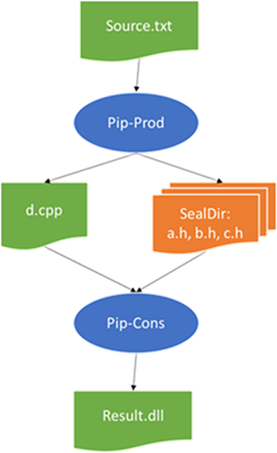

# Introduction
Sealed Directories provide a way to treat a set of files under the same directory root as a single build artifact.  This feature is extremely convenient since in BuildXL all process dependencies are defined in terms of build artifacts.  

For example, it is not uncommon that many processes depend on a set of standard header files; instead of declaring a dependency for each process on each header file, it is much less verbose, hence more manageable, to define a single sealed directory containing all the header files, and then for each process declare that it depends on the sealed directory.

There are four types of Sealed directories:
1. Full sealed directories
1. Partial sealed directories
1. Source sealed directories
1. Opaque sealed directories, in two flavors: exclusive and shared.

| Type | Graph construction time | Reading | Writing |
| --- | --- | --- | --- |
| Full sealed directory | Files in the directory are known | All listed files are allowed to be read | No pip is allowed to write to this directory after it is sealed |
| Partial sealed directory | Files in the directory are known | All listed files are allowed to be read | Other pips are allowed to write to this directory
| [Source Sealed Directories](./Sealed-Directories/Source-Sealed-Directories.md) | The list of files is empty | All files in the folder (whether to recursively include subfolders is configurable) | No pip is allowed to write to this directory after it is sealed |
| [Exclusive Opaque Directories](./Sealed-Directories/Opaque-Sealed-Directories.md) | The list of files is empty | A pip determines the content at build time; upon its completion, only the produced files are allowed to be read by other pips | Exactly one pip is allowed to write to this directory |
| [Shared Opaque Directories](./Sealed-Directories/Shared-Opaque-Directories.md) | The list of files is empty | A pip determines the content at build time; upon its completion, only the produced files are allowed to be read by other pips | Multiple pips are allowed to write to this directory |

## Creation

The [Sdk.Transformers](/BuildXL/Reference-Guide/Sdk-Documentation/Sdk.Transformers) module provides the necessary API.  For example:

```ts
import {Transformer} from "Sdk.Transformers";

// Full: This seals all the files in the sealed directory. No pip can produce any output file in that folder
const full = Transformer.sealDirectory(d`dir1`, [
    f`dir1\file1.txt`,
    f`dir1\file2.txt`,
    f`dir1\file3.txt`,
    f`dir1\file4.txt`,
]);

// Partial: This seals some of the files in the sealed directory. Other pips can still write to that folder.
const partial1 = Transformer.sealPartialDirectory(d`dir2`, [
    f`dir2\file1.txt`,
    f`dir2\file2.txt`,
]);
const partial2 = Transformer.sealPartialDirectory(d`dir2`, [
    f`dir2\file3.txt`,
    f`dir2\file4.txt`,
]);

// Source: These seal all the files in the source tree. No pip is allowed to write to that folder. The contents field is empty after creation.
const sourceTop = Transformer.sealSourceDirectory(d`dir3`, SealSourceDirectoryOption.topDirectoryOnly);
const sourceAll = Transformer.sealSourceDirectory(d`dir4`, SealSourceDirectoryOption.allDirectories);

// Exclusive opaque: These can only be defined by running a process and declaring an output directory. The contents field is empty after creation.
...
   let outDir = d`dir5`
   let result = Transformer.createProcess({
        ....
       outputs: [ outDir ],
        ....
    });
    const outputDir = result.getOutputDirectory(outDir);

// Shared opaque: These can only be defined by running a process and declaring a shared opaque output directory. The contents field is empty after creation.
...
   let outDir = d`dir6`
   let result = Transformer.createProcess({
        ....
       outputs: [ {directory: outDir, kind: "shared"} ],
        ....
    });
    const outputDir = result.getOutputDirectory(outDir);
...


```

## Incrementality
Sealed Directories also help with incrementality, as they allow the user to over-specify process dependencies without adversely affecting incrementality.  Concretely, BuildXL will rerun a process only if any of the files it actually read from the sealed directory have changed.  In other words, a process that depends on a sealed directory will not be rerun if there is a file in the sealed directory that has changed but the process didn't previously read it.  This is different from single-file input artifacts: if such a file changed BuildXL reruns the tool regardless of whether the tool read it or not.

 

The arrows represent the data-flow.  Pip-Cons only reads `d.cpp` and `a.h` it does not read `b.h` or `c.h`.
(When I say rerun it can also mean cache-lookup to restore the artifacts)

1. If a user changes the content of `source.txt`. Pip-Prod will rerun.
    1. If pip-Prod will produce the same outputs (by hash) Pip-Cons will not rerun.
    1. If Pip-Prod will produce the same outputs for `a.h`, `b.h` and `c.h` but different content for `d.cpp`  => Pip-Cons will run
    1. If Pip-Prod will produce the same outputs for `d.cpp`, `b.h` and `c.h` but different content for `a.h` => Pip-Cons will run
    1. If Pip-Prod will produce the same outputs for `d.cpp`, `a.h`, `c.h`  but different content for `b.h` => Pip-Cons will do a cache lookup but from the cache will learn that c.h does not impact it so Pip-Cons will not rerun.
1. If a user changes or deletes `d.cpp`, `a.h`, `b.h` or `c.h` Pip-Prod will rerun. If Pip-Prod will rerun depends on the rules of a)
1. If a user changes the spec to add a new file to the SealDir: Pip-Prod will rerun and Pip-Cons will not rerun, this is the same case as a-d)
1. If a user changes the location (parent directory) of `d.cpp` Pip-Prod and Pip-Cons will both rerun because the location and hash of the input files are part of the fingerprint
1. If a user changes the location of the sealed Directory, Pip-Prod and Pip-Cons will both rerun (because their hash changes since the file location of the sealed dir is part of the fingerprint)
1. If a user changes `d.cpp` from a file dependency to put it in a sealed directory. Both Pip-Prod and Pip-Cons will rerun because their fingerprints will change.

Note that we also track “directory enumeration” in BuildXL that might cause a pip to rerun. I.e. if we observe a process doing the equivalent of `dir`/`ls` we record this as well. If a new file is introduced between builds we will rerun the pip. Now there are some policies that we allow to be configured on a per-tool basis to restrict and not go crazy but in short you can assume BuildXL will do the right thing.

We also track ‘probes’ i.e. if a process looks for the existence of a file. So if you delete a file from a sealed directory that was previously read, we will rerun the pip. If the previous run checked for the existance of `d.h` and the next run you introduce this file, we will rerun the pip.
