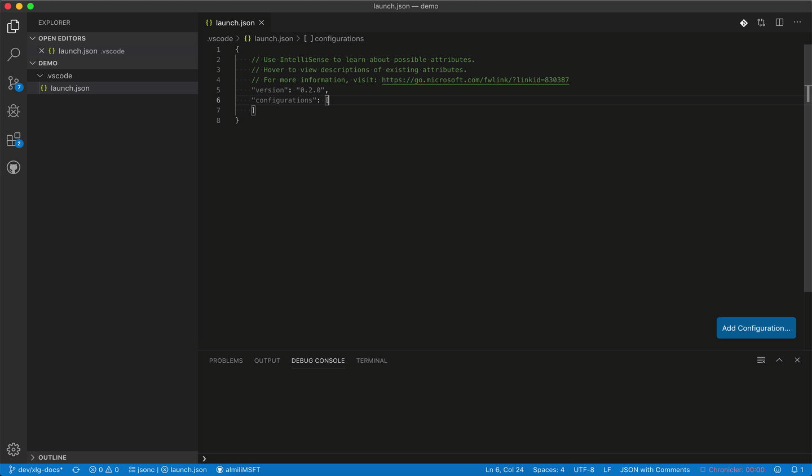
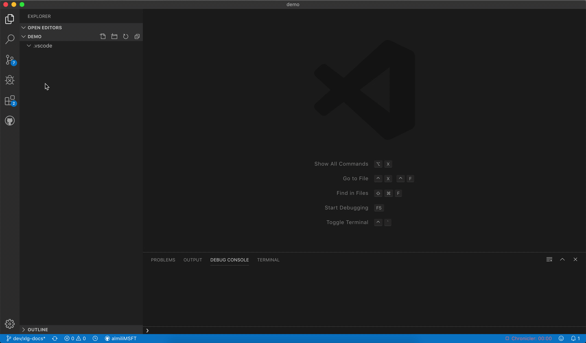
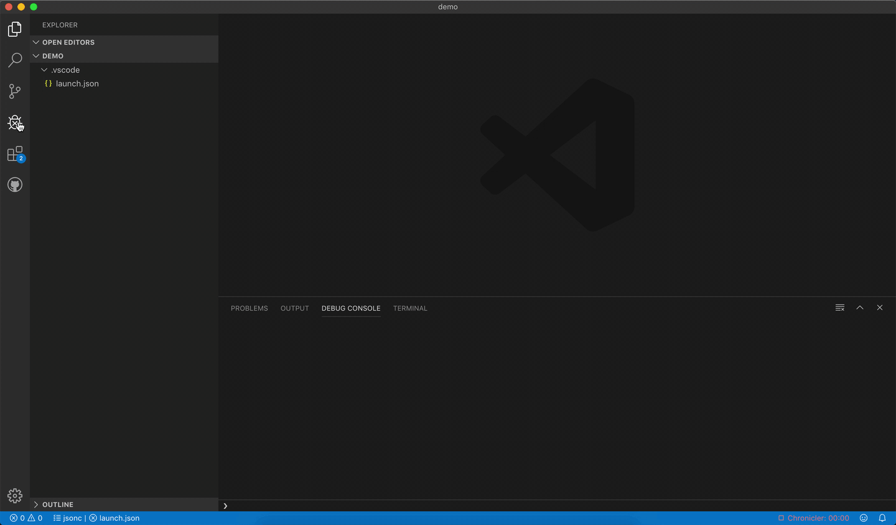
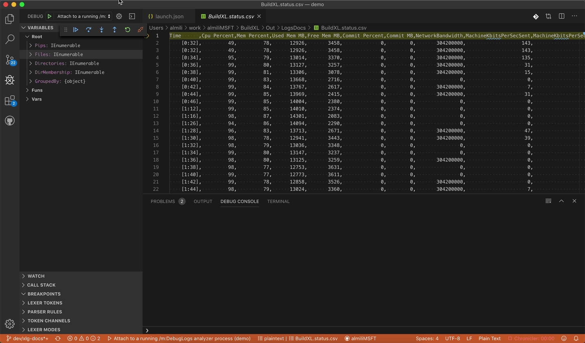

# Installation

## Installing DScript VSCode Extension

To install DScript VSCode extension, please refer to [DScript VSCode plugin](/Documentation/Wiki/Installation.md#dscript-visual-studio-code-plug-in).  

## Configuring XLG Debugger

Once installed, add the following configuration snippet to your `.vscode/launch.json`:
```javascript
{
    "name": "Attach to a running /m:DebugLogs analyzer process",
    "type": "xlg",
    "request": "attach",
    "debugServer": 41188
}
```


If no `.vscode/launch.json` file exists in your workspace, it can be created manually or using the wizard accessible from the Debugger pane:


## Running

1. Start the execution analyzer in `DebugLogs` mode and point it to an XLG file
    - on Windows: `bxlanalyzer.exe /m:DebugLogs /xl:MyBxlLogs\BuildXL.xlg`
    - on Mac: `./bxlanalyzer /m:DebugLogs /xl:MyBxlLogs/BuildXL.xlg`

    The execution analyzer should outputs something like
    ```
    [17:01:52.60] info DX9900: DScript debug server started on port 41188 (async)
    ```
1. Once this log message appears, attach to this debug server from VSCode by switching to "Debug" pane, selecting the previously entered XLG debug configuration, and clicking "Start Debugging":

    

## Commands

### XLG: Render Status CSV File

Open a `BuildXL.status.csv` file in VSCode, then execute "XLG: Render Status CSV File" command via the command pallette.  The command will ask you to enter columns from the CSV that should be offered in the rendered graph, as well as the columns that should be immediately rendered; leaving the defaults works perfectly fine.


