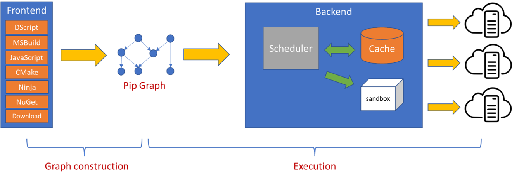
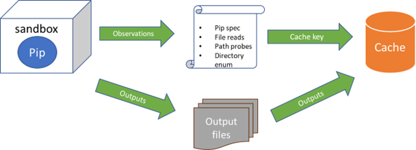

# Core concepts

BuildXL is a general-purpose build engine that supports correct and reliable cached and incremental builds, and
single-machine as well as distributed builds in both Windows and Linux platforms. BuildXL has also been proven to
scale to large codebases (e.g., Windows/Office repositories) where builds can consist of millions of processes with 
terabytes of outputs. BuildXL relies on runtime file-access monitoring for correct caching and distribution.

## Pips and pip graph

The BuildXL engine takes a build graph (a directed acyclic dependency graph) as an input and executes
each node in the graph according to the dependency order. The node in the build graph is called a *pip* (for Primitive 
Indivisible Process), and thus the build graph itself is called a *pip graph*.

In general, one can think of a pip as a process that BuildXL launches during the build. A pip consists of
information for executing the process, i.e., executable, arguments, and working directory. A pip can also specify
input/output files/directories, environment variables, paths/directories that file-access monitoring should ignore (also
referred to as *untracked* directories/paths). In particular, when a pip *P*'s outputs are specified as another
pip *Q*'s inputs, then there is a dependency edge in the pip graph from *Q* to *P*.

A process pip can represent a simple compilation pip, like executing a compiler tool. A process pip can also represent
a coarse-grained operation, like encapsulating a project-level call in MsBuild or JavaScript projects, or even
a call to another build engine.

For efficient builds, besides process pips, BuildXL also has write-file and copy-file pips. A *write-file pip* is used
to write a string content to a file, while a *copy-file pip* is used to copy a file to a specified output location. The
execution of a write-file or a copy-file pip does not launch any process; BuildXL simply calls an API for writing 
a file or for copying a file, respectively.

BuildXL also has so-called service and IPC pips. A *service pip* represents a long running or background process.
An *IPC pip* is used to talk to the service pip to perform some action. For example, to implement a drop functionality,
BuildXL can use a service pip to represent a drop service, and for each relevant produced file, use an IPC pip to instruct
the drop service to drop the file to the specified end point. Details on service and IPC pips can be found in
[Service & IPC pips](./Service-Pips.md).

## Build phases

A BuildXL build consists of 2 phases, as shown by the following figure:

### Graph construction phase

The graph construction phase is responsible for constructing a pip graph. BuildXL supports various frontends. DScript
frontend is the native build language for BuildXL. DScript is a TypeScript language describing dependencies (or data flow)
between pips in the build. 

BuildXL understands MsBuild and JavaScript projects using MsBuild and JavaScript frontends, respectively. The MsBuild
frontend calls MsBuild static graph API to create a MsBuild project graph, which in turn is converted into a pip graph where
each of the pip represent a project-level call. Similarly, the JavaScript frontend calls a build graph adapter that
understand various JavaScript orchestrators to create a project graph. Currently, the JavaScript frontend supports
Rush, Yarn, and Lage orchestrators.

BuildXL has frontends for CMake/Ninja specifications. The frontends run CMake/Ninja, and rely on a plugin to create a Ninja process graph that is then converted into a pip graph.

BuildXL has frontends that can handle using packages or downloading files during the build. Currently, BuildXL only supports
using NuGet pacakages.

A build specification can use multiple frontends at the same time. For example, BuildXL's selfhost builds use DScript, NuGet,
and download frontends at the same time.

Note that during this phase BuildXL only constructs a pip graph, but does not execute any pip. Since the graph construction
can be expensive, the constructed pip graph itself can be cached by observing files, directories, and environment variables
used during the graph construction. 

Details on BuildXL frontends can be found in [Frontends](./Frontends.md).

### Execution phase

In this phase BuildXL executes each pip in the graph according to the dependency order. Particularly for each process pip,
the scheduler checks if the pip has a cache hit, and if it does, then the pip's outputs are deployed from the cache.
Otherwise, the pip will be executed in a *sandbox* that has a runtime file-access monitoring capability.
After the execution, the pip's specification as well as the observations from the sandbox are used as a key (or
fingerprint) for caching the pip's outputs.

## Sandboxing / Runtime file-access monitoring

BuildXL executes process pips in a sandbox that has a runtime file-access monitoring capability. This runtime monitoring
produces an observation set that will be used as part of the cache key. The observations include file reads, (absent)
file probes, and directory enumerations. This runtime monitoring allows BuildXL to verify that all dependencies are
tracked. If, during its execution, a process pip is observed to consume files that are not declared as its dependencies,
then BuildXL will issue a file-access violation error and make the pip not eligible for caching.

For Windows builds, BuildXL implements the file-access monitoring using
the [Detours](https://www.microsoft.com/en-us/research/project/detours/) technology.
For Linux builds, BuildXL implements the file-access monitoring using a combination of
[interpose](https://www.jayconrod.com/posts/23/tutorial-function-interposition-in-linux) and
[ptrace](https://man7.org/linux/man-pages/man2/ptrace.2.html).

Details on sandboxing and runtime monitoring can be found in [Sandboxing](../Specs/Sandboxing.md).

## Caching

After the execution, the pip's (static) specification as well as the observations from the sandbox are used as a key for
caching the pip's outputs.

BuildXL computes a fingerprint from the pip's specification, which includes the executable path, the arguments, the working
directory, specified environment variables, etc. For files specified statically as inputs (or dependencies), BuildXL
computes fingerprints based on their contents (**not** timestamp), and includes these fingerprints as part of the cache key.

The observations resulting from the runtime monitoring are also used to compute the cache key. These observations
include: file reads, (absent) file probes, and directory enumerations. For file reads, BuildXL uses the content
fingerprint of the read file. For directory enumerations, BuildXL computes the directory membership fingerprint.
Thus, if the read file changes, or if a file is added or removed from an enumerated directory, then in the next build,
the pip will get a cache miss and will be executed.

Details on how BuildXL performs caching can be found in
[Two-Phase Cache Lookup](Advanced-Features/Two-Phase-Cache-Lookup.md).

## Distributed builds

BuildXL supports distributed builds in the CloudBuild (internal) and Azure DevOps platforms. In a distributed
build, one machine runs BuildXL as the orchestrator, while other machines run BuildXL as workers. The orchestrator
is responsible for constructing the pip graph, and for scheduling the executions of the pips. The workers receive
instruction from the orchestrator to execute pips. 

BuildXL relies on a remote L3 cache and/or a peer-to-peer cache for distributed builds. When a process pip executes
on a worker, its outputs are pushed to the cache, so that the dependent pips, that need those outputs and run
on different workers, can pull those outputs from the cache before their executions begin.

## Feedback
See something missing you want added to this page? Contact the BuildXL team using one of the links below: 
 * Microsoft Internal: [aka.ms/buildxl](https://aka.ms/buildxl)
 * External: Open a [Github Issue](https://github.com/microsoft/BuildXL/issues/new)