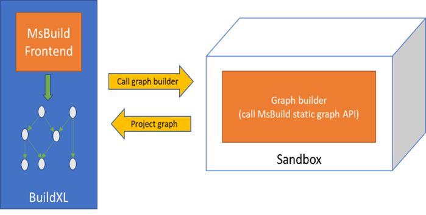

# Working with MSBuild frontend

BuildXL provides native support for building MSBuild-based repository using its MSBuild frontend. This frontend leverages the MSBuild
static graph API to get a build graph that can be translated into BuildXL pip graph. Each node in the pip graph executes MSBuild on
a project instance, and the execution result is assigned a symbol that can be referred to by other frontends. This reference
allows, for example, a process declared in a DScript frontend to consume the execution result of a MSBuild project instance.

Currently MSBuild frontend has only been tested on Windows.

## The basics

Building a MSBuild-based repository using BuildXL is typically as simple as adding a MSBuild resolver (a frontend instance) 
in the BuildXL configuration file, `config.dsc`, that specifies where to find the entry point of the build, and this entry point can
be the root of the repository:
```typescript
config({
    resolvers: [
        {
            kind: "MsBuild",
            root: d`.`,
            moduleName: "HelloWorld",
        }
    ]
});
```
The `kind` property specifies that the resolver is a MSBuild resolver. The root of the MSBuild build is specified as 
the directory where `config.dsc` is located. BuildXL will try to find files in that directory whose extension ending
with `proj` or `sln`. The MSBuild portion built by the resolver
is considered as a single BuildXL module, and the `moduleName` property specifies the module name.

Each project file in the MSBuild build is assigned a symbol that can be referred by other frontends. The symbol denotes
the execution result of all project instances of the project file. This symbol resembles the relative path of the project
file from the root. For example, if the build has a project file `source\dev\Foo.Bar.csproj`, then a DScript project (specified)
in a DScript resolver can consume the execution result of that project by referring to its symbol:
```typescript
const x = importFrom("HelloWorld").source_dev_Foo_Bar;
```
For details on DScript, see [DScript](../DScript/Main.md).

## More resolver settings

The MSBuild resolver has plenty of settings. In what follows, we will explain some of them that are commonly used. The complete settings
can be found at [Prelude.Configuration.Resolvers.dsc](../../../../Public/Sdk/Public/Prelude/Prelude.Configuration.Resolvers.dsc).

*msBuildSearchLocations*. This property specifies the directories to search for MSBuild toolset. When not specified, the location
is determined using [Microsoft build locator](https://github.com/Microsoft/MSBuildLocator).

*fileNameEntryPoints*. This property specifies the relative paths from the root to the projects or solutions to start parsing the MSBuild repository.

*initialTargets*. This property specifies targets to execute on the entry point project. If not provided, the default targets are used.

*environment*. This property specifies the environment variables available for building all projects. 
If it is undefined, then the current process' enviroment is made available for building all projects.
It is always advised to explicitly specify these environment variables to avoid cache misses due to churn of environment variable values.

*globalProperties*. Similar to building with MSBuild, the MSBuild frontend of BuildXL allows for specifying additional global properties.

*logVerbosity*. This option controls the logging verbosity of MSBuild. It is an enum that has the same set of values as the ones offered by MSBuild.

*enableBinLogTracing*. This option enables binlog tracing in MSBuild, and the `msbuild.binlog` file is going to be placed in the log directory.

*enableTransitiveProjectReferences*. This option allows projects to access the transitive closure of its references. Enabling this option
can affect the build performance particularly in the distributed builds where all possible inputs must be available before the project is
executed. Unfortunately, many existing MSBuild repositories rely on this assumption.

*useLegacyProjectIsolation*. MSBuild projects are not treated as first class citizens and MSBuild is instructed to build each project using the legacy mode, which relies on SDK conventions to respect the boundaries of a project and not build dependencies. To avoid overbuilds, when using legacy
project isolation, BuildXL will internally perform project merging of inner and outer projects. See [here](https://github.com/microsoft/msbuild/blob/master/src/Build/Graph/ProjectInterpretation.cs) for more details.

*allowProjectsToNotSpecifyTargetProtocol*. This option allows projects to not specify their target protocol. In such a case default targets will be
used as heuristics.

A more complete example of a MSBuild resolver is as follows:

```typescript
config({
    resolvers: [
        {
            kind: "MsBuild",
            root: d`.`,
            fileNameEntryPoints: [r`HelloWorld.csproj`],
            moduleName: "HelloWorld",
            environment: Map.empty<string, string>().addRange(
                ["Env1", "Val1"],
                ["Env2", "Val2"])
            globalProperties: Map.empty<string, string>().addRange(
                ["Configuration", "Release"],
                ["Platform",      "x64"]),
            logVerbosity: "minimal",
            enableBinLogTracing: true
        },
    ]
)
```

## Design and implementation

MSBuild frontend relies on the [MSBuild static graph API](https://github.com/dotnet/msbuild/blob/main/documentation/specs/static-graph.md) to create
a project graph. MSBuild frontend launches a so-called graph builder tool during the [graph construction phase](../../CoreConcepts.md) of BuildXL.
to build a MSBuild project graph, as shown below:



The graph builder tool is launched in a sandbox so that BuildXL can monitor the file accesses and use those accesses for caching, i.e., 
BuildXL does not need to construct MSBuild graph if nothing has changed. Once the project graph is obtained, BuildXL will turn it into
BuildXL pip graph. The [execution phase](../../CoreConcepts.md) of BuildXL will execute each of the pip in the graph according to the dependency order.

## Examples

- [Building a simple Hello World C# project](./Walkthrough-Building-CSProj.md)
- [Building a simple Hello World VCX project](./Walkthrough-Building-VCXProj.md)
- [Building a hybrid MSBuild and DScript projects](./Walkthrough-Building-Hybrid.md)

