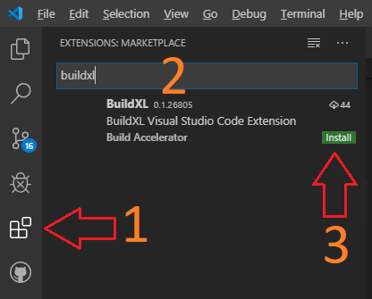

# Installing BuildXL

## Build Engine
Prebuilt binaries for BuildXL are only distributed internally within Microsoft. Externally you'll need to build the project locally from the main branch of its repo. See the [Developer Guide](DeveloperGuide.md) for instructions.

## DScript [Visual Studio Code](https://code.visualstudio.com) Plug-in

### Windows
You can find the plugin in the marketplace under "BuildXL". It should be recommended for our repo.

The steps to take are:

## Visual Studio Plugin for opening generated solutions
This plugin enables C# and C++ target language support for building using BuildXL in Visual Studio. It is meant to be used in conjunction with the command line `bxl -vs` command that generates .g.csproj and .g.vcxproj files from DScript build specs.

### Acquire the plugin
You can build it locally with this command: `bxl out\bin\debug\ide\*`. And find the resulting file will be dropped at: `out\bin\debug\ide\BuildXL.vs.vsix`. You can install it by simply running the vsix.

If you see a message like this: `The application which this project type is based on was not found. Please try this link for further information: http://go.microsoft.com/fwlink/?LinkID=299083&projecttype=DABA23A1-650F-4EAB-AC72-A2AF90E10E37` then you need to build and install the plugin. This is the plugin's GUID which is referenced from the generated proj files from `bxl -vs`.