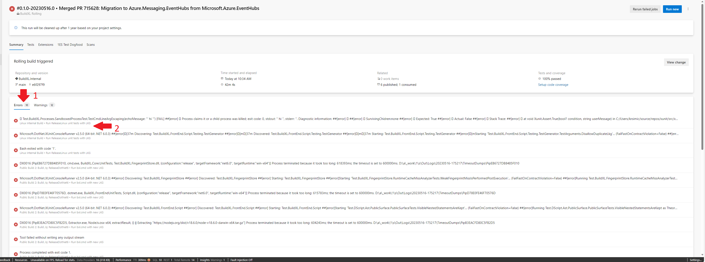
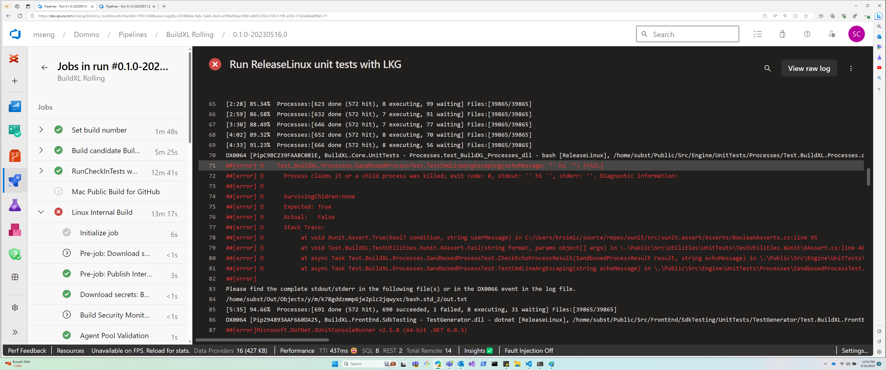
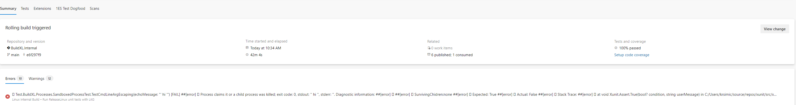
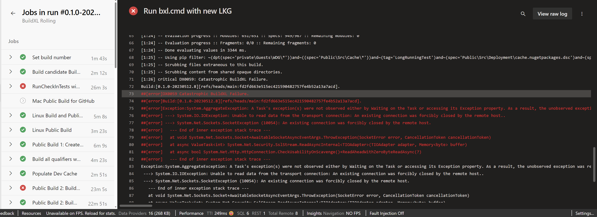
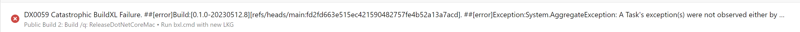

# Interpreting ADO Error Log Messages.
The purpose of this document is to offer guidance on the process of debugging and analyzing log messages containing errors in ADO.

## Navigate To Errors Section.
If the build happens to contain errors they are displayed in a separate section below the Build Info section. By clicking on those individual tabs one can go to the specific error related information.

Then the specific error messages highlighted in red are displayed in the ADO console.

## Error Messages.
In most of the cases the error messages logged by BXL are created by specific BXL event and contain an error code. 
See [Error-Codes](Wiki/Interpreting-BXL-Outputs/Interpreting-ADO-Console-Error-Messages.md) to get familiar with some of common errors in BXL. 

Some of the other errors are pretty straightforward and descriptive to give the required information about the cause of the error.

## DX0064 Errors.
Within the category of error messages that carry error codes, there exists a specific category known as PipProcessErrors. These particular error messages bear the code DX0064 as an identifying feature. PipProcessErrors primarily encompass errors encountered during the execution of a build process (namely, a pip), which can manifest in various forms such as syntax errors, null pointer errors, type errors, and more. The errors in question exhibit a distinct pattern when displayed in BXL as opposed to other formats.

The DX64 error message extends across a range of lines, starting from line number 70 and continuing up to line number 85 in the above image.
DX64 error message construct - "[{pipSemiStableHash}, {pipDescription}, {pipSpecPath}] - failed with {exitCode} {optionalMessage}\r\n{outputToLog}\r\n{messageAboutPathsToLog}\r\n{pathsToLog}".
In order to debug such error messages with ease, the main cause behind the error - OutputToLog is highlighted in red the remaining lines of the error messages appear in grey.
These errors appear as below in the Summary page.

## Non-DX0064 Errors.
In contrast to DX64 errors, there is no distinctive representation or pattern observed for these errors within the ADO console. The entire error message is highlighted in red color.
For example in the image below the error message with an error code of DX0059 and it extends across a range of lines, starting from line number 73 and continuing up to line number 82 in the above image.

These errors appear as below in the Summary page.

