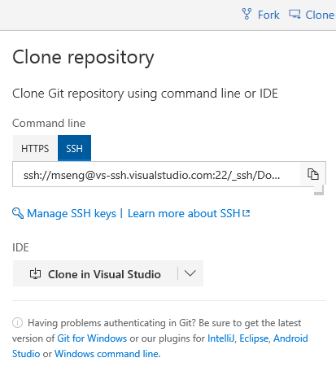
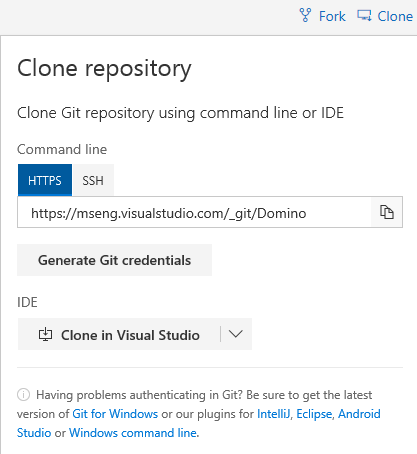

# Introduction
Simple "HelloWorld"-type examples for building with BuildXL on the Mac.

# Getting Started
  * Download the latest BuildXL DotnetCore binaries
    * NuGet feed:
```
    https://1essharedassets.visualstudio.com/1esPkgs/_packaging?_a=feed&feed=BuildXL%40release
```
  * set `BUILDXL_BIN` environment variable to point to a BuildXL .NET Core deployment, e.g.,
```bash
    unzip BuildXL.osx-x64.0.1.-20190101.1.nupkg -d buildxl_bin
    export BUILDXL_BIN=$(cd buildxl_bin && pwd)
```
  * configure your git for either HTTPS or SSH access
    - go to [https://aka.ms/BuildXLGit](https://aka.ms/BuildXLGit)
    - click "Clone" in the upper right corner
    - for SSH access:
      - click "SSH"
      - click "Manage SSH keys" and follow the instructions
      - contact domdev@microsoft.com to request permissions

      
    - for HTTPS access:
      - click "HTTPS"
      - click "Generate Git credentials"
      - remember the generated username/password (which you'll need to enter when prompted by git in the step below)

      
  * clone the BuildXL repository and change directory to `BuildXL/Examples/DotNetCoreBuild`
    (depending on how you configured your git, connect either via SSH or HTTPS)
```bash
    git clone ssh://mseng@vs-ssh.visualstudio.com:22/_ssh/BuildXL
    # (alternatively) git clone https://aka.ms/BuildXLGit
    cd BuildXL/Examples/DotNetCoreBuild
```
  * run `build.sh` if on a *nix system, or `build.bat` if on Windows
```bash
    ./build.sh
```

If everything goes well, the output should look something like:
```
[info] Checking BuildXL bin folder
[info] BUILDXL_BIN set to /Users/userName/work/buildxl_bin
[info] Symlinking sdk folder from BuildXL deployment: .../Examples/DotNetCoreBuild/sdk/Sdk.Prelude -> $BUILDXL_BIN/Sdk/Sdk.Prelude
[info] Symlinking sdk folder from BuildXL deployment: .../Examples/DotNetCoreBuild/sdk/Sdk.Transformers -> $BUILDXL_BIN/Sdk/Sdk.Transformers
[info] Running BuildXL
Microsoft (R) Build Accelerator. Version: [Developer Build]
Copyright (C) Microsoft Corporation. All rights reserved.

[0:03] info DX7500:  *** Scheduled a pip to print "HelloWorldViaPip" to file "/Users/userName/work/BuildXL/Examples/DotNetCoreBuild/Out/Objects/b/8/c2m7gdjt6q5qo1nl1q08y7qp778ghh/cmd/stdout.txt" ***
[0:04] 100.00% - 1 done (0 hit), 0 executing, 0 waiting
[0:04] -- Cache savings: 0.000% of 1 included processes. 0 excluded via filtering.
Build Succeeded
    Log Directory: /Users/userName/work/BuildXL/Examples/DotNetCoreBuild/Out/Logs/20180403-111757
BuildXL Succeeded
```
